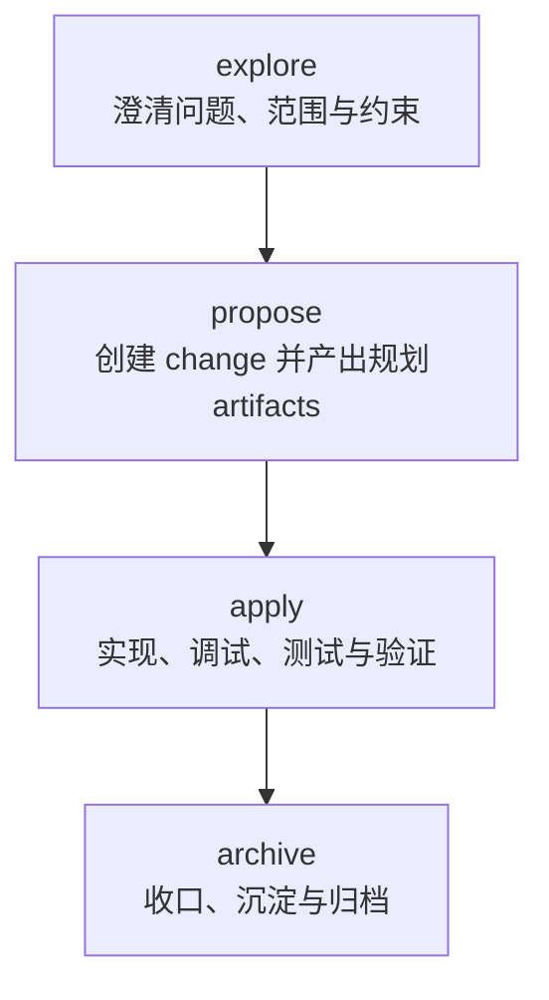
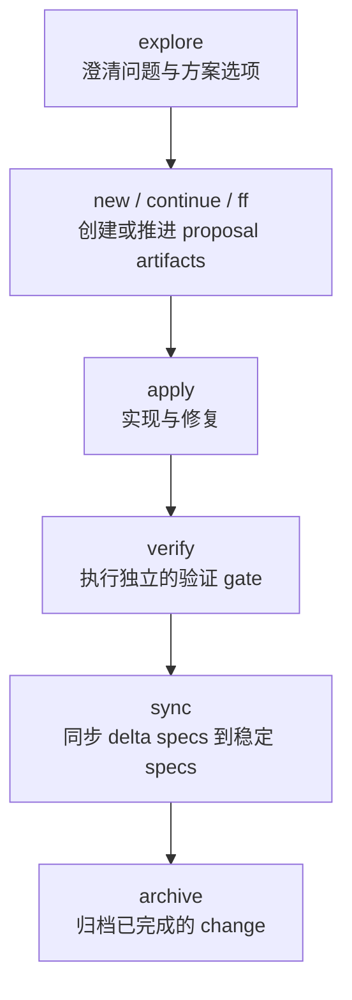
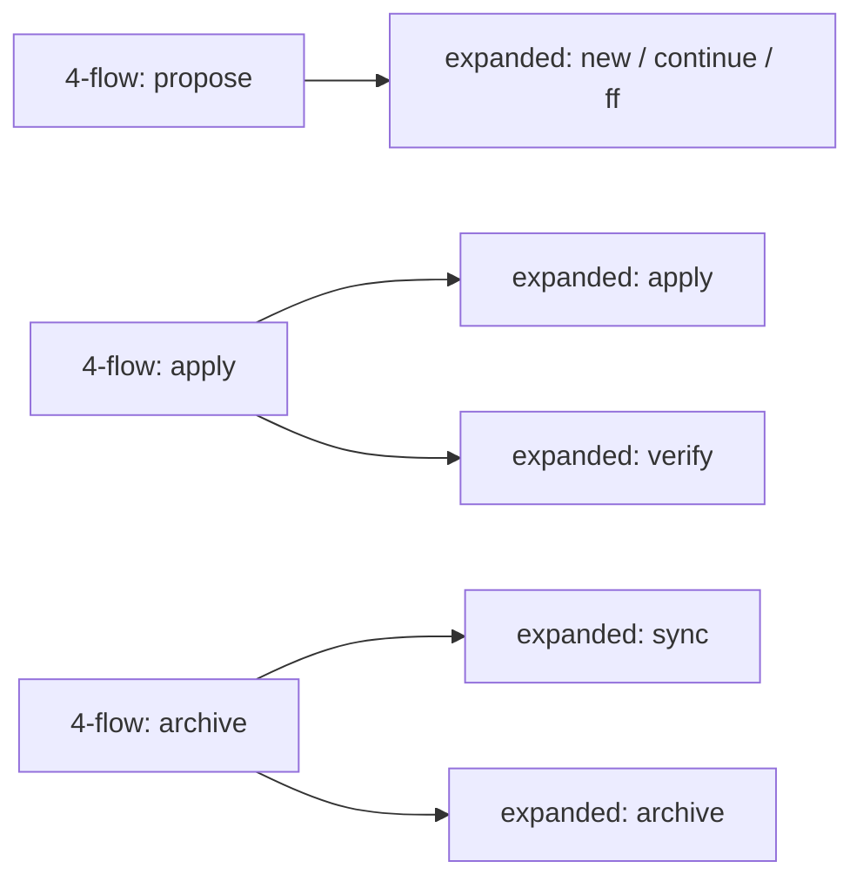

# 4-Flow 与 Expanded Flow 对比

本文用于说明标准 4-flow 与 expanded flow 的差异，以及为什么 Praxis DevOS 当前选择 4-flow 作为默认产品形态。

## 范围

本文使用以下术语：

- **4-flow**：`explore -> propose -> apply -> archive`
- **expanded flow**：把 proposal 推进、verification、spec sync 等步骤进一步显式化的更细粒度 change 生命周期

为了方便内部讨论，本文把 expanded 模式按 **6-flow** 来描述：

- `explore`
- `new / continue / ff`
- `apply`
- `verify`
- `sync`
- `archive`

这里刻意不把 `onboard` 算入比较范围，因为它不属于常规的单个 change 生命周期。

## 摘要

两者的核心差异，不在于 expanded flow 拥有本质上更多的能力，而在于它把更多生命周期步骤暴露成了用户可见的显式命令。

Praxis DevOS 保持默认 4-flow，原因是：

- 它已经覆盖一个 change 的完整生命周期
- 它给用户提供了更简单、更稳定的路由模型
- SuperPowers 仍然可以作为嵌入式执行能力运行在各个 stage 内部
- 对大多数团队来说，更少的可见入口比更细的协议粒度更有产品价值

## 生命周期对比

### 标准 4-flow

### Expanded flow

## 映射关系

expanded 模型本质上是在拆分 4-flow 里原本已经隐含存在的工作。

## 详细差异

| 维度 | 4-flow | Expanded flow |
|---|---|---|
| 可见入口数 | 4 个 | 更多，阶段更细 |
| 用户心智模型 | 一个 change 四步走完 | 一个 change 被拆成更多显式步骤 |
| Proposal 推进 | 折叠在 `propose` 中 | 拆成 `new`、`continue`、`ff` |
| 验证阶段 | 通常内嵌在 `apply` 中 | `verify` 作为独立 stage 暴露 |
| Spec 同步 | 通常内嵌在 `archive` 中 | `sync` 作为独立 stage 暴露 |
| 产品复杂度 | 更低 | 更高 |
| 协议显式程度 | 更低 | 更高 |
| 适用对象 | 大多数团队、默认产品流 | 高级用户、严格门禁、平台编排 |

## 4-flow 实际已经包含什么

不能把 4-flow 误解成“能力较少”的模型。

在 Praxis DevOS 中，用户可见的 stage 仍然只有：

- `explore`
- `propose`
- `apply`
- `archive`

但这些 stage 内部仍然可以嵌入执行能力，例如：

- brainstorming
- planning
- debugging
- verification
- change-scoped docs work
- release/readiness checks

这正是当前产品决策的核心：对外保持小而稳定的工作流，对内保留丰富的执行能力。

## 为什么 Praxis DevOS 选择 4-flow

### 1. 它已经覆盖完整的 change 生命周期

`explore -> propose -> apply -> archive` 已经足够把一个 change 从模糊需求推进到最终收口。

expanded 模式并没有引入新的生命周期，只是把其中若干内部转移显式化了。

### 2. 它显著降低了用户的路由成本

在 4-flow 下，用户通常很容易知道自己现在应该走哪一步：

- 还在想：`explore`
- 要定义 change：`propose`
- 要开始实现或修 bug：`apply`
- 要收尾沉淀：`archive`

而在 expanded flow 下，用户还要额外判断：

- 现在应该用 `new`、`continue` 还是 `ff`
- verification 是否要单独显式执行
- sync 是否要在 archive 之前独立运行

这对高级控制是有价值的，但对大多数团队会明显增加流程摩擦。

### 3. 它更适合嵌入式 SuperPowers 模型

Praxis DevOS 的思路不是把每一种执行能力都暴露成单独的可见工作流，而是把执行能力嵌入当前 OpenSpec stage 中。

这意味着：

- `propose` 内部可以调用 artifact generation、clarification、planning 等能力
- `apply` 内部可以调用 debugging、testing、verification 等能力
- `archive` 内部可以在最终收口前调用 verification 和 sync 相关能力

因此，4-flow 更适合作为产品表层，而不是能力边界。

### 4. 它有利于区分“产品体验”和“底层协议”

expanded flow 更接近协议层或系统视角：

- 生命周期拆得更细
- 阶段边界更显式
- 更适合编排和审计

4-flow 更接近产品视角：

- 命令更少
- 解释成本更低
- onboarding 更简单
- 用户更不容易选错入口

对于一个产品化的 workflow harness，这个取舍通常是对的。

## Expanded flow 仍然可能有价值的场景

expanded flow 在以下场景中仍然可能值得支持：

- 团队要求 `verify` 必须作为独立、可见的 gate
- 团队要求 `sync` 在 archive 之前独立执行，并且需要被审计
- 平台或自动化编排环境需要更窄、更显式的生命周期命令
- 高级用户需要更直接地控制 proposal 推进过程

但即使在这些场景里，更合理的方向也通常不是替换默认 4-flow，而是把 expanded flow 作为高级模式叠加在同一套内部 capability cores 之上。

## 为什么统一投放 OpenSpec Assets

这里的 OpenSpec assets 指当前工作流直接相关的用户可见资产：

- 4 个 flow skills
- 4 个对应 commands

Praxis DevOS 不准备简单镜像 OpenSpec 的多目录投放策略，即不因为多个 agent 可能识别不同目录，就在项目中为每个 agent 都重复投放一整套相同的 OpenSpec workflow assets。

选择统一投放的主要原因如下。

### 1. 项目维护体验比实现便利更重要

从 OpenSpec 自身实现角度看，向每个 agent 目录都投一份 assets 很直接。

但从项目维护人的视角看，这会带来明显问题：

- 一个项目里出现多份重复 skill 和 command
- 隐藏目录数量增加，项目结构变重
- 团队成员难以判断哪些目录真正需要关注
- review、清理、排障时都更容易混乱

Praxis DevOS 更关注项目维护体验，因此不会把“实现简单”作为唯一准则。

### 2. 多 agent 团队不应该承担重复资产成本

同一个项目里，团队成员可能分别使用：

- Codex
- Claude Code
- OpenCode

如果为了兼容每种 agent 的目录发现逻辑，就在项目里复制同一套 OpenSpec assets，多 agent 团队会天然承受更多文件噪音和维护负担。

这种重复并不会给项目本身带来新的业务价值，只会增加管理成本。

### 3. Workflow 语义应该单一，不应在项目中散落多份副本

Praxis DevOS 的工作流设计目标是：

- 同一个项目只有一套统一的 workflow 语义
- 团队成员无论使用哪个 agent，看到的都是同一套 stage contract
- superpowers 扩展逻辑不因为目录不同而出现多份近似副本

如果在多个目录中重复投放，很容易让“同一套工作流”退化成“多份大致相似但各自存在漂移风险的副本”。

### 4. 统一投放更符合 Praxis 的产品定位

OpenSpec 更接近 upstream workflow runtime。

Praxis DevOS 更接近面向团队协作体验的 product layer。

因此，Praxis DevOS 可以兼容 OpenSpec 的 workflow 语义，但不必机械复制 OpenSpec 的目录投放习惯。对于 Praxis 来说，更重要的是：

- 项目保持尽量简洁
- 共享规则保持单一
- agent-specific 差异尽量收敛到更薄的一层

### 5. 统一投放有利于后续升级和治理

一旦项目中存在多份重复 assets，后续升级时就要面对：

- 哪些目录必须更新
- 哪些目录只是兼容遗留
- 多份 skill/command 是否完全一致
- 清理旧版本时是否会误删

统一投放可以把这些问题显著收敛，使升级路径、版本比对和 managed-assets 治理都更清晰。

## 关于投放策略的当前结论

当前阶段，Praxis DevOS 记录以下决策：

1. 不镜像 OpenSpec 的多目录重复投放策略。
2. 不因为多个 agent 可识别不同目录，就在同一项目里复制多份相同 workflow assets。
3. OpenSpec 的 workflow assets 需要由 Praxis 统一管理和投放，以保证：
   - workflow 语义单一
   - 项目目录尽量简洁
   - 后续升级成本可控
4. 对 OpenSpec upstream 的跟随，优先通过统一投放与受控 projection 实现，而不是通过在多个目录重复复制结果实现。

## 对 Praxis DevOS 的设计启示

如果未来真的需要支持 expanded flow，更合适的实现方向是：

1. 保持 4-flow 作为默认用户工作流。
2. 继续把 `propose`、`apply`、`archive` 作为主要产品阶段。
3. 把内部能力内核进一步解耦，做到可复用：
   - artifact-generation core
   - verification core
   - spec-sync core
4. 在不改变默认工作流契约的前提下，按需暴露高级 expanded 模式。

这样可以同时保留产品层面的简洁性，以及后续支持更显式生命周期控制的扩展空间。

## 结论

expanded 模型更显式，但并不意味着它本质上更强。

Praxis DevOS 选择 4-flow 作为默认形态，是因为它是更好的产品表层：

- 足够完整
- 更容易教学
- 更容易路由
- 与嵌入式 SuperPowers 更契合
- 不会把本可留在内部的流程细节过早暴露给用户
